 

  
    <a href="https://medium.com/@harshthkkr/gsoc-2025-with-openmrs-improved-implementer-tools-284518951560">gsoc work ↗</a>&nbsp;&nbsp;
    <a href="https://gamehub-harsh.vercel.app/">game//hub ↗</a>&nbsp;&nbsp;
    <a href="https://github.com/harshthakkr/game-hub">game//hub source ↗</a>&nbsp;&nbsp;
    <a href="https://github.com/harshthakkr/payments-app">payments-app ↗</a>
  

  

<picture>
  <source media="(prefers-color-scheme: dark)" srcset="https://raw.githubusercontent.com/harshthakkr/harshthakkr/output/snake-dark.svg" />
  <source media="(prefers-color-scheme: light)" srcset="https://raw.githubusercontent.com/harshthakkr/harshthakkr/output/snake-light.svg" />
  
</picture>

  

  

